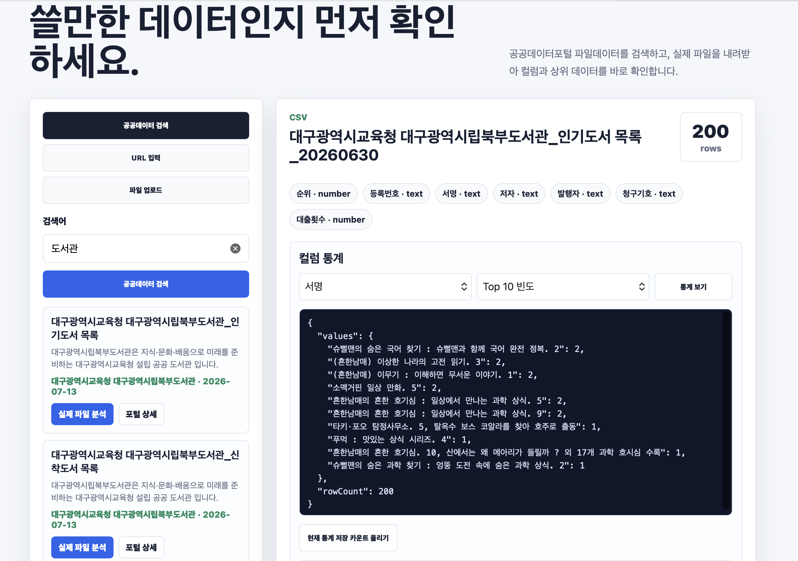

# Public Data Inspector

> 공공데이터를 내려받기 전에, 프로젝트에 쓸 만한 데이터인지 먼저 확인하는 바이브코딩 기반 MVP

공공데이터포털의 파일 데이터를 검색하고 실제 CSV·JSON 파일을 분석해 컬럼, 자료형, 미리보기와 통계를 한 화면에서 확인할 수 있는 웹 서비스입니다.



## 프로젝트 소개

공공데이터포털에는 수많은 데이터가 있지만, 데이터의 구조와 품질을 확인하려면 파일을 직접 내려받아 별도의 도구로 열어봐야 합니다.

Public Data Inspector는 이 과정을 줄이기 위해 만들었습니다.

```text
공공데이터 검색 → 실제 파일 분석 → 컬럼·데이터 미리보기 → 통계 확인 → 아카이빙 → 프로젝트 활용
```

단순히 데이터를 찾는 데서 끝나지 않고, **내 프로젝트에 사용할 수 있는 데이터인지 빠르게 판단하는 것**이 핵심입니다.

## 바이브코딩으로 만든 프로젝트

이 프로젝트는 완성된 명세를 먼저 만들고 코드를 작성하는 방식보다, 해결하고 싶은 문제를 자연어로 구체화하고 AI와 대화하며 기능을 빠르게 구현·검증하는 **바이브코딩 방식**으로 개발했습니다.

아이디어를 실제 동작하는 MVP로 전환하는 과정에 집중했습니다.

1. “공공데이터를 내려받기 전에 내용을 확인하고 싶다”는 문제 정의
2. 검색·미리보기·통계라는 핵심 사용자 흐름 설계
3. 기능 단위로 백엔드 API와 화면을 빠르게 구현
4. 실제 공공데이터를 사용해 동작 확인
5. 테스트와 예외 처리를 추가하며 결과를 반복 개선

AI가 코드를 대신 작성하는 데 그치지 않고, 요구사항을 기능으로 나누고 구현 결과를 실행해 확인하면서 다음 방향을 결정하는 협업 도구로 활용했습니다.

## 주요 기능

### 공공데이터 탐색

- 공공데이터포털 파일 데이터 키워드 검색
- 데이터명, 제공기관, 수정일과 설명 확인
- 포털 상세 페이지 바로가기
- 선택한 실제 파일 다운로드 및 분석

### 데이터 미리보기

- CSV 및 JSON 파일 지원
- 공개 파일 URL 또는 로컬 파일 업로드 지원
- 전체 행 개수와 컬럼 목록 확인
- 컬럼별 `number`, `text`, `date` 자료형 추론
- 상위 5개 데이터 미리보기

### 컬럼 통계

- 항목별 개수
- Top 10 빈도
- 빈 값 개수
- 숫자 최솟값·최댓값·평균·합계
- 날짜 데이터 월별 분포

### 데이터 활용 관리

- 관심 데이터 아카이빙 및 메모·태그 관리
- 프로젝트 보드 생성
- 공개 GitHub 저장소 연결
- 프로젝트 README용 데이터 출처 문구 생성
- 데이터 검토용 GitHub 이슈 초안 생성
- 아카이브 및 통계 대시보드 확인

## 기술 스택

| 구분 | 기술 |
| --- | --- |
| Backend | Java 25, Spring Boot 4.1, Spring Web MVC |
| Frontend | HTML, CSS, Vanilla JavaScript |
| Data | CSV, JSON, Jackson |
| Build / Test | Gradle Kotlin DSL, JUnit 5, AssertJ |
| External | 공공데이터포털, GitHub REST API |

## 실행 방법

### 요구 사항

- JDK 25
- Gradle 9 이상

### 실행

```bash
git clone https://github.com/HannaYang116/public-data-inspector-demo.git
cd public-data-inspector-demo
gradle bootRun
```

실행 후 브라우저에서 [http://localhost:8081](http://localhost:8081)로 접속합니다.

### 테스트

```bash
gradle test
```

## 프로젝트 구조

```text
src/main/java/com/example/datainspector
├── analyze      # CSV·JSON 분석 및 미리보기
├── portal       # 공공데이터포털 검색 및 파일 다운로드
├── statistics   # 컬럼 통계 계산과 집계
├── workspace    # 아카이브와 프로젝트 보드
└── github       # 공개 GitHub 저장소 연결

src/main/resources
├── static       # HTML, CSS, JavaScript 화면
└── application.yml
```

## 현재 MVP 범위

현재 버전은 아이디어와 핵심 사용자 흐름을 검증하기 위한 MVP입니다.

- 아카이브와 프로젝트 정보는 메모리에 저장되어 서버 재시작 시 초기화됩니다.
- 로그인 없이 데모 사용자 한 명을 기준으로 동작합니다.
- 분석 가능한 파일 크기는 최대 2MB이며 CSV와 JSON을 지원합니다.
- 공공데이터포털 화면 구조가 변경되면 검색 로직 수정이 필요할 수 있습니다.

## 다음 개선 방향

- 회원가입과 로그인, 사용자별 워크스페이스
- 데이터베이스를 이용한 아카이브 영구 저장
- XLSX 등 분석 파일 형식 확대
- 결측치·이상치와 데이터 품질 점수 제공
- 통계 결과 차트 시각화
- 공공데이터 평가 및 사용자 간 분석 결과 공유

---

**Public Data Inspector**는 바이브코딩을 통해 아이디어를 빠르게 구현하고, 실제 데이터로 검증하며 발전시킨 공공데이터 탐색 MVP입니다.
